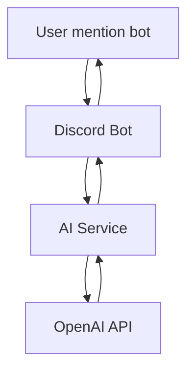

# 🤖 AIDiscordBot

> 🚀 Bot Discord tích hợp AI chat và các lệnh tiện ích cơ bản.


---

## ✨ Tính năng

🔹 **AI Chat thông minh**
- Chat với bot bằng cách mention
- Có thể lưu context hội thoại (nếu implement memory)

🔹 **Slash Commands tiện ích**
- `/help` → Hiển thị danh sách lệnh  
- `/ping` → Kiểm tra độ trễ bot  
- `/userinfo` → Thông tin người dùng  
- `/roll` → Random số 🎲  
- `/countdown` → Đếm ngược sự kiện  
- `/sync` → Đồng bộ lệnh (admin)

---

## 📦 Cài đặt

### 1. Clone repo

```bash
git clone https://github.com/Thangtn52751/AIDiscordBot.git
cd AIDiscordBot
````

### 2. Cài dependencies

```bash
pip install -r requirements.txt
```

### 3. Cấu hình biến môi trường

Tạo file `.env`:

```env
DISCORD_TOKEN=your_discord_token
OPENAI_API_KEY=your_openai_key
DISCORD_GUILD_ID=your_guild_id
```

---

## ▶️ Chạy bot local

```bash
python main.py
```

---

## 🚀 Deploy Railway

Project đã có sẵn:

* `railway.json`
* `railpack.json`
* `nixpacks.toml`

Railway sẽ tự chạy:

```bash
python main.py
```

---

## 🧠 Cách hoạt động



---

## 📁 Cấu trúc project

```
AIDiscordBot/
│── cogs/            # Slash commands
│── services/        # AI xử lý chat
│── core/            # Config, utils
│── main.py          # Entry point
│── requirements.txt
```

---

## ⚠️ Lưu ý

* Không commit `.env`
* Tránh lộ `DISCORD_TOKEN` & `OPENAI_API_KEY`
* Railway nên dùng ENV variables

---

## ❤️ Đóng góp

Pull request luôn được chào đón!

```bash
fork → create branch → commit → push → pull request
```

---

## 📜 License

MIT License

